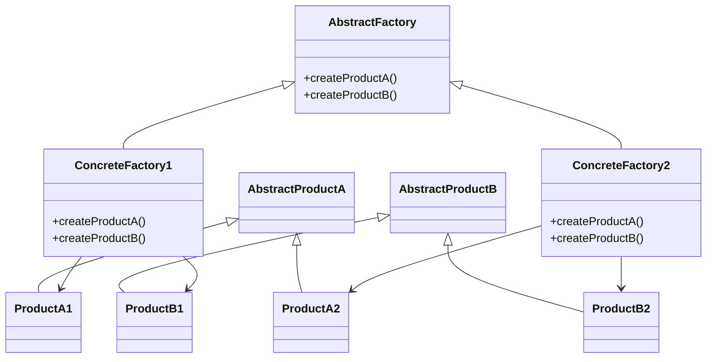
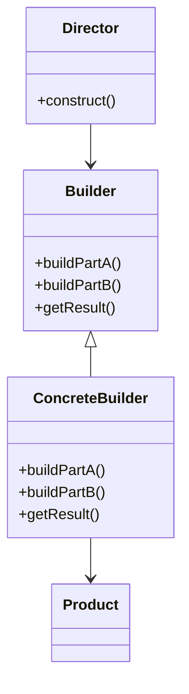
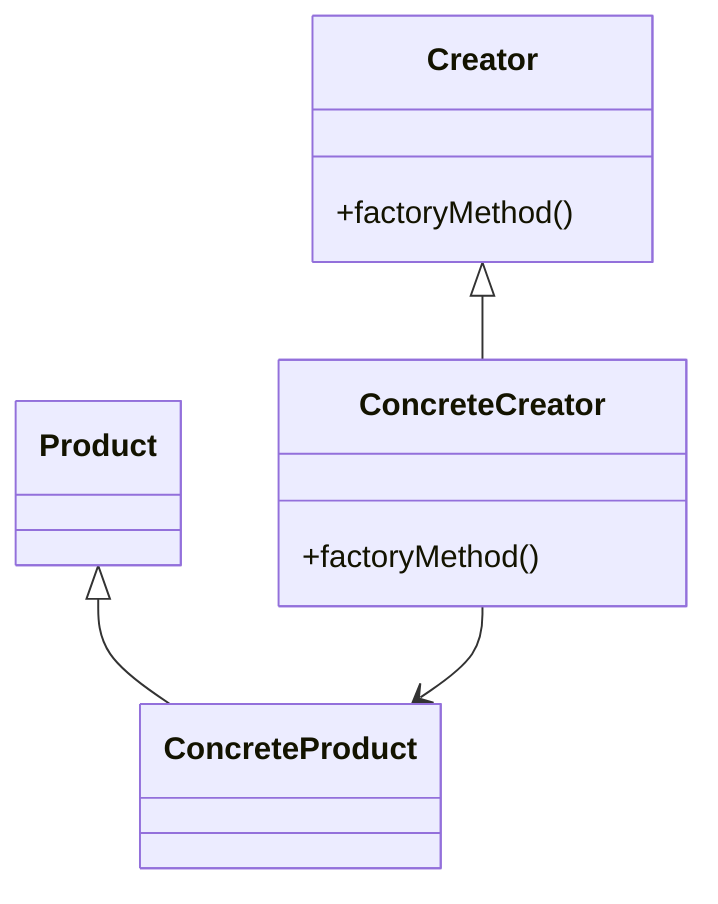
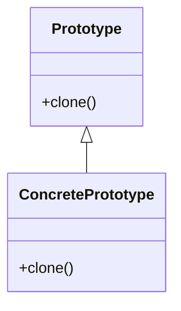
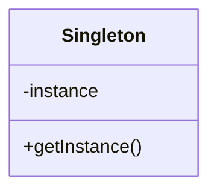

# Design Patterns

## SOLID Design Principles

SOLID is a set of five principles that help developers design maintainable, scalable, and robust object-oriented systems.

### Principles

1. **Single Responsibility Principle (SRP)**
    - *Definition*: A class should have only one reason to change, meaning it should have only one job or responsibility.
    - *Application*: Split classes that handle multiple concerns (e.g., data access and business logic) into separate classes.

2. **Open/Closed Principle (OCP)**
    - *Definition*: Software entities should be open for extension but closed for modification.
    - *Application*: Use interfaces or abstract classes so new functionality can be added by extending existing code rather than modifying it.

3. **Liskov Substitution Principle (LSP)**
    - *Definition*: Subtypes must be substitutable for their base types without altering the correctness of the program.
    - *Application*: Ensure derived classes extend base classes without changing expected behavior.

4. **Interface Segregation Principle (ISP)**
    - *Definition*: Clients should not be forced to depend on interfaces they do not use.
    - *Application*: Split large interfaces into smaller, more specific ones so classes only implement what they need.

5. **Dependency Inversion Principle (DIP)**
    - *Definition*: High-level modules should not depend on low-level modules; both should depend on abstractions.
    - *Application*: Use dependency injection and program to interfaces, not concrete implementations.

### Application Example

Consider a payment processing system:

- **SRP**: Separate classes for payment validation, processing, and notification.
- **OCP**: Add new payment methods by extending a base `PaymentProcessor` class.
- **LSP**: All payment processors (e.g., `CreditCardProcessor`, `PaypalProcessor`) can be used interchangeably.
- **ISP**: Different interfaces for payment, refund, and reporting so processors only implement relevant methods.
- **DIP**: The main payment service depends on an `IPaymentProcessor` interface, not concrete classes.

**Interview Question:**  
Q: What are SOLID principles and why are they important?  
A: SOLID principles guide the design of software that is easy to maintain, extend, and test by promoting separation of concerns, flexibility, and robustness.

## Classification of Design Patterns

Design patterns can be classified into three main categories: Creational, Structural, and Behavioral.

### Creational Design Patterns

Creational design patterns deal with object creation mechanisms, trying to create objects in a manner suitable to the situation. The basic form of object creation could result in design problems or added complexity to the design. Creational design patterns solve this problem by controlling the object creation process.

- **Abstract Factory**
- **Builder**
- **Factory Method**
- **Prototype**
- **Singleton**

### Structural Design Patterns

Structural design patterns deal with object composition or the way to realize relationships between entities. They help ensure that if one part of a system changes, the entire system doesn't need to change along with it.

- **Adapter**
- **Bridge**
- **Composite**
- **Decorator**
- **Facade**
- **Flyweight**
- **Proxy**

### Behavioral Design Patterns

Behavioral design patterns deal with object collaboration and responsibility delegation. They help in defining how objects interact and communicate with each other.

- **Chain of Responsibility**
- **Command**
- **Interpreter**
- **Iterator**
- **Mediator**
- **Memento**
- **Observer**
- **State**
- **Strategy**
- **Template Method**
- **Visitor**

### Diagram

Below is a diagram representing the classification of design patterns:

```plaintext
+-------------------+        +-------------------+        +-------------------+
|   Creational      |        |   Structural      |        |   Behavioral      |
|-------------------|        |-------------------|        |-------------------|
| - Abstract Factory|        | - Adapter         |        | - Chain of Resp.  |
| - Builder         |        | - Bridge          |        | - Command         |
| - Factory Method  |        | - Composite       |        | - Interpreter     |
| - Prototype       |        | - Decorator       |        | - Iterator        |
| - Singleton       |        | - Facade          |        | - Mediator        |
|                   |        | - Flyweight       |        | - Memento         |
|                   |        | - Proxy           |        | - Observer        |
|                   |        |                   |        | - State           |
|                   |        |                   |        | - Strategy        |
|                   |        |                   |        | - Template Method |
|                   |        |                   |        | - Visitor         |
+-------------------+        +-------------------+        +-------------------+
```


## Creational Design Patterns
### UML Diagram for Creational Design Patterns

#### Abstract Factory UML Diagram



**Interview Question:**  
Q: What is the Abstract Factory pattern and where is it used?  
A: Abstract Factory provides an interface for creating families of related objects without specifying their concrete classes.  
**Real-world example:** GUI toolkits that support multiple themes (Windows, MacOS) use Abstract Factory to create themed widgets.

---

#### Builder UML Diagram



**Interview Question:**  
Q: How does the Builder pattern help in object construction?  
A: Builder separates the construction of a complex object from its representation, allowing the same construction process to create different representations.  
**Real-world example:** Building a meal at a fast-food restaurant, where you can customize each part (burger, drink, side).

---

#### Factory Method UML Diagram



**Interview Question:**  
Q: What is the Factory Method pattern and when should it be used?  
A: Factory Method defines an interface for creating an object, but lets subclasses alter the type of object that will be created.  
**Real-world example:** Document editors (Word, PDF, etc.) use Factory Method to instantiate different document types.

---

#### Prototype UML Diagram



**Interview Question:**  
Q: What problem does the Prototype pattern solve?  
A: Prototype allows creating new objects by copying existing ones, useful when object creation is expensive or complex.  
**Real-world example:** Creating new graphic objects in a drawing application by duplicating existing shapes.

---

#### Singleton UML Diagram



**Interview Question:**  
Q: How is Singleton implemented and what are its pitfalls?  
A: Singleton restricts instantiation of a class to one object and provides a global access point.  
**Real-world example:** Logger class in an application, ensuring only one logging instance exists.

### Interview Questions & Answers: Creational Design Patterns

**Q1: What is the purpose of creational design patterns?**  
A: Creational design patterns abstract the instantiation process, making it more flexible and reusable. They help manage object creation, especially when objects are complex or require configuration.

**Q2: Explain the Singleton pattern and its use case.**  
A: Singleton ensures a class has only one instance and provides a global point of access. It's useful for managing shared resources like configuration or logging.

**Q3: How does the Factory Method differ from Abstract Factory?**  
A: Factory Method defines an interface for creating a single product, letting subclasses decide which class to instantiate. Abstract Factory provides an interface for creating families of related products without specifying concrete classes.

**Q4: When would you use the Builder pattern?**  
A: Use Builder when constructing complex objects step by step, especially when the construction process must allow different representations.

**Q5: What problem does the Prototype pattern solve?**  
A: Prototype allows object creation by cloning an existing instance, useful when object creation is costly or complex.

**Q6: Can you give a real-world example of a Singleton?**  
A: A configuration manager in an application, where only one instance should exist to manage settings.

**Q7: What are the drawbacks of using Singleton?**  
A: Singleton can introduce global state, making testing and maintenance harder. It can also hinder scalability in multi-threaded environments if not implemented carefully.

