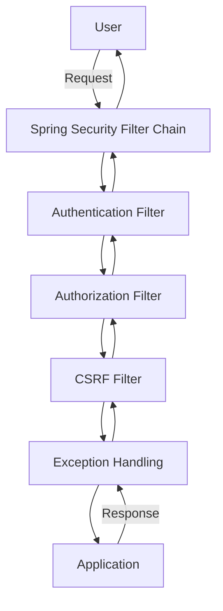
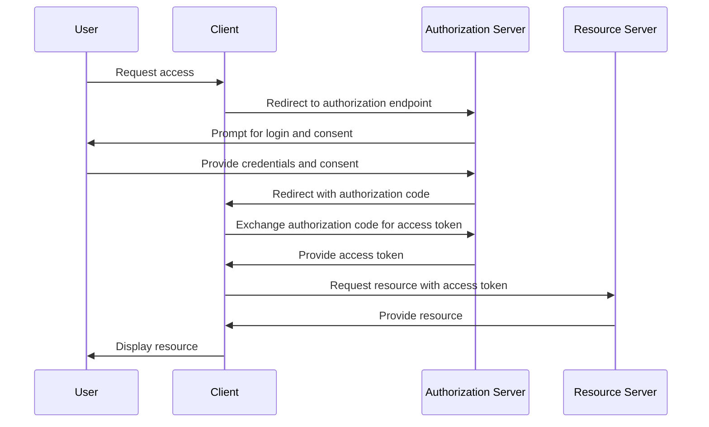
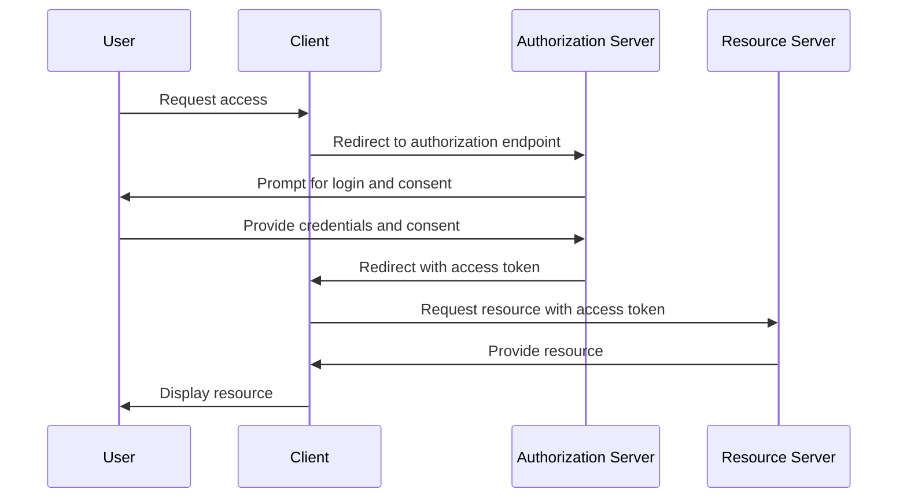
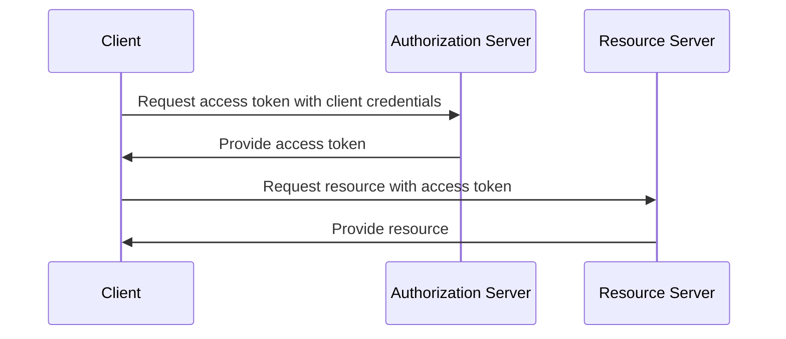
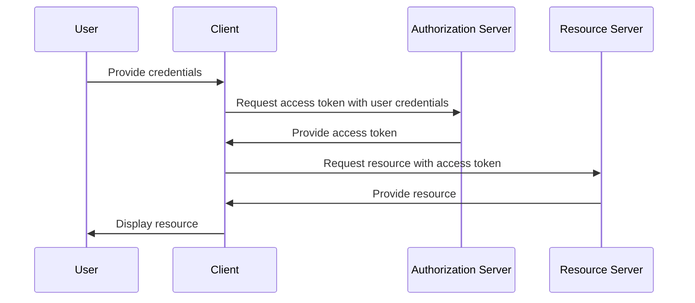
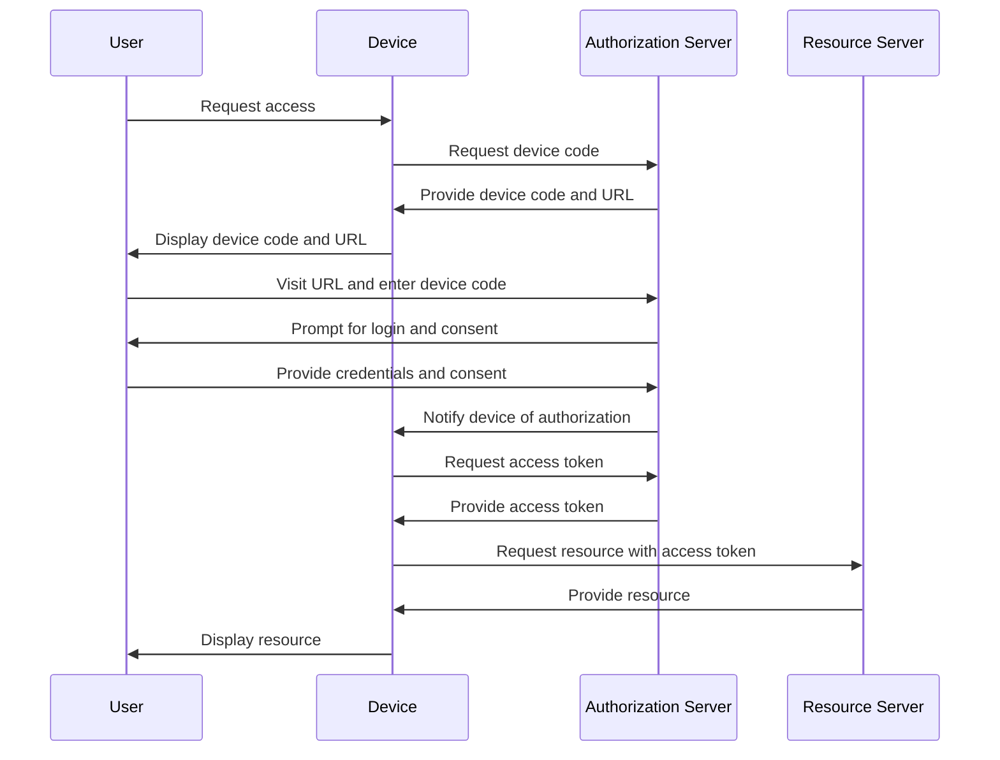
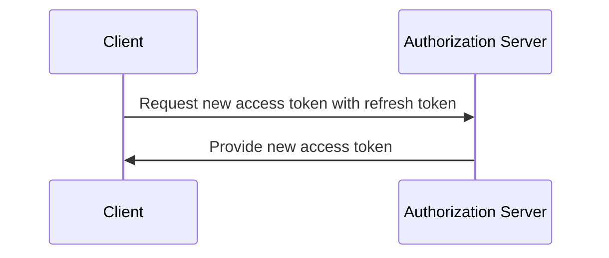
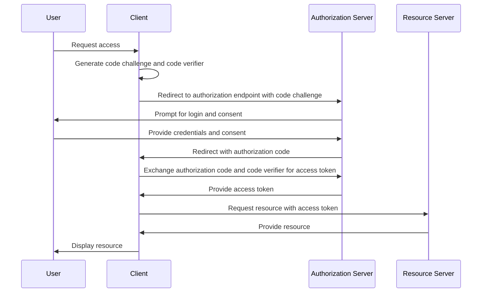

# Spring Security 3.0 Components

## List of Components

1. [Authentication](#authentication)
2. [Authorization](#authorization)
3. [Security Context](#security-context)
4. [Filters](#filters)
5. [Exception Handling](#exception-handling)
6. [Access Control](#access-control)
7. [CSRF Protection](#csrf-protection)
8. [Session Management](#session-management)

## Authentication

### What
Authentication is the process of verifying the identity of a user or system.

### Why
It ensures that only legitimate users can access the application.

### When
Use authentication to protect resources and ensure that users are who they claim to be.

### Example
A user logs in with a username and password, which are verified against a database.

## Authorization

### What
Authorization is the process of determining whether a user has permission to access a resource.

### Why
It ensures that users can only access resources they are allowed to.

### When
Use authorization to enforce access control policies.

### Example
A user with the role "ADMIN" can access the admin dashboard, while a user with the role "USER" cannot.

## Security Context

### What
The Security Context holds the security information of the current user.

### Why
It provides a way to access the authenticated user's details throughout the application.

### When
Use the security context to retrieve the current user's information.

### Example
Accessing the current user's roles to determine if they have permission to perform an action.

## Filters

### What
Filters are used to intercept and process requests before they reach the application.

### Why
They provide a way to apply security checks and transformations to requests and responses.

### When
Use filters to enforce security policies, such as authentication and authorization.

### Example
A filter that checks if a user is authenticated before allowing access to a resource.

## Exception Handling

### What
Exception handling in Spring Security deals with security-related exceptions.

### Why
It ensures that security exceptions are handled gracefully and appropriately.

### When
Use exception handling to manage authentication and authorization errors.

### Example
Redirecting a user to a login page when an authentication exception occurs.

## Access Control

### What
Access control defines the rules for who can access what resources.

### Why
It ensures that only authorized users can access certain parts of the application.

### When
Use access control to enforce security policies based on user roles and permissions.

### Example
Using annotations like `@PreAuthorize` to restrict access to methods based on user roles.

## CSRF Protection

### What
CSRF (Cross-Site Request Forgery) protection prevents unauthorized commands from being transmitted from a user that the web application trusts.

### Why
It protects against attacks where a malicious site tricks a user into performing actions on another site.

### When
Use CSRF protection to secure state-changing requests.

### Example
Including a CSRF token in forms and validating it on the server side.

## Session Management

### What
Session management deals with how user sessions are handled in the application.

### Why
It ensures that user sessions are secure and managed properly.

### When
Use session management to control session creation, expiration, and concurrency.

### Example
Invalidating a user's session after a certain period of inactivity.

## Architecture Diagram

### Diagram

# OAuth2 Flows
## List of OAuth2 Flows

1. [Authorization Code Flow](#authorization-code-flow)
2. [Implicit Flow](#implicit-flow)
3. [Client Credentials Flow](#client-credentials-flow)
4. [Resource Owner Password Credentials Flow](#resource-owner-password-credentials-flow)
5. [Device Code Flow](#device-code-flow)
6. [Refresh Token Flow](#refresh-token-flow)
7. [PKCE (Proof Key for Code Exchange) Flow](#pkce-proof-key-for-code-exchange-flow)

## Authorization Code Flow

### What
The Authorization Code Flow is a multi-step process used to obtain an access token. It involves the client, the authorization server, and the resource server.

### Why
This flow is used because it provides a high level of security by ensuring that the client never sees the user's credentials. It is suitable for web applications where the client can securely store the client secret.

### When
Use this flow when you have a web application that can securely store the client secret and you need to authenticate users.

### Example
A real-world example is when a user logs into a web application using their Google account. The web application redirects the user to Google's authorization server, where the user logs in and consents to the application accessing their data. Google then redirects the user back to the application with an authorization code, which the application exchanges for an access token.

### Flow Diagram

## Implicit Flow

### What
The Implicit Flow is a simplified version of the Authorization Code Flow designed for public clients, such as single-page applications (SPAs).

### Why
This flow is used because it reduces the number of steps and does not require the client to store a client secret. However, it is less secure because the access token is exposed to the user agent.

### When
Use this flow when you have a single-page application or another public client that cannot securely store a client secret.

### Example
A real-world example is when a user logs into a single-page application using their Facebook account. The application redirects the user to Facebook's authorization server, where the user logs in and consents to the application accessing their data. Facebook then redirects the user back to the application with an access token.

### Flow Diagram

## Client Credentials Flow

### What
The Client Credentials Flow is used by clients to obtain an access token by using their own credentials, rather than impersonating a user.

### Why
This flow is used because it allows the client to authenticate itself directly with the authorization server. It is suitable for machine-to-machine (M2M) communication.

### When
Use this flow when you have a client that needs to access resources on behalf of itself rather than a user, such as a backend service.

### Example
A real-world example is when a backend service needs to access an API to retrieve data. The service authenticates itself with the authorization server using its client credentials and obtains an access token, which it uses to access the API.

### Flow Diagram

## Resource Owner Password Credentials Flow

### What
The Resource Owner Password Credentials Flow allows the client to obtain an access token by directly asking the user for their credentials.

### Why
This flow is used because it allows the client to obtain an access token in a single step. However, it is less secure because the client has access to the user's credentials.

### When
Use this flow only when you have a high level of trust in the client and it is absolutely necessary to obtain the user's credentials directly.

### Example
A real-world example is when a mobile application asks the user to log in with their username and password. The application sends the credentials to the authorization server, which validates them and returns an access token.

### Flow Diagram

## Device Code Flow

### What
The Device Code Flow is designed for devices with limited input capabilities, such as smart TVs or IoT devices. It allows the user to authorize the device by using another device with a browser.

### Why
This flow is used because it provides a way for devices with limited input capabilities to obtain an access token without requiring the user to enter credentials directly on the device.

### When
Use this flow when you have a device with limited input capabilities that needs to authenticate a user.

### Example
A real-world example is when a user wants to log into a streaming service on their smart TV. The TV displays a code and instructs the user to visit a URL on their phone or computer to enter the code and authorize the device.

### Flow Diagram

## Refresh Token Flow

### What
The Refresh Token Flow allows the client to obtain a new access token using a refresh token without requiring the user to re-authenticate.

### Why
This flow is used because it allows the client to maintain access to resources over a long period without requiring the user to repeatedly log in.

### When
Use this flow when you need to maintain long-term access to resources and want to improve the user experience by reducing the need for repeated logins.

### Example
A real-world example is when a user logs into a web application and receives an access token and a refresh token. When the access token expires, the application uses the refresh token to obtain a new access token without requiring the user to log in again.

### Flow Diagram

## PKCE (Proof Key for Code Exchange) Flow

### What
The PKCE Flow is an extension to the Authorization Code Flow designed to provide additional security for public clients, such as mobile and single-page applications.

### Why
This flow is used because it mitigates the risk of authorization code interception attacks by requiring the client to generate and verify a code challenge and code verifier.

### When
Use this flow when you have a public client that cannot securely store a client secret and you want to enhance the security of the Authorization Code Flow.

### Example
A real-world example is when a mobile application uses the PKCE Flow to authenticate a user with their Google account. The application generates a code challenge and code verifier, which are used during the authorization process to ensure the authorization code is not intercepted.

### Flow Diagram
